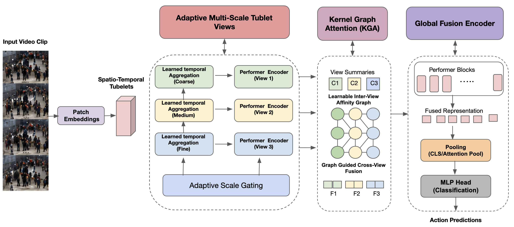
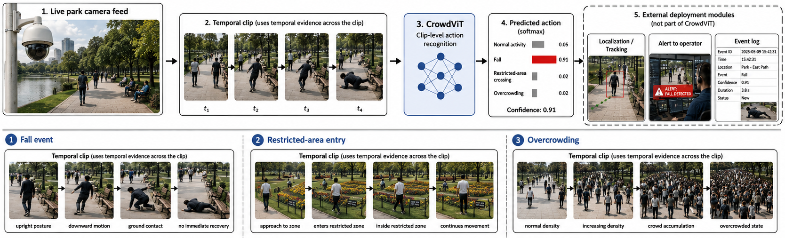
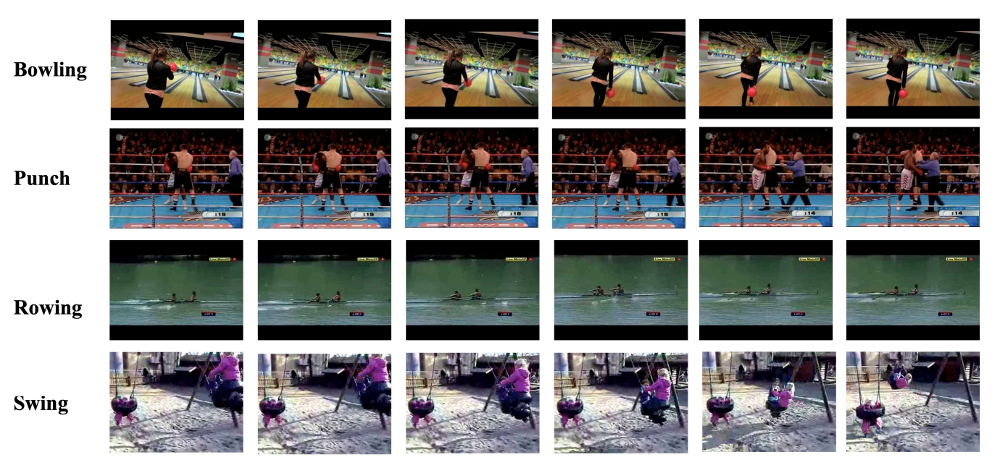

# 🎥 CrowdViT

**A Multi-Scale Performer-Graph Transformer for Efficient Real-Time Video Action Recognition**

> An original, from-scratch PyTorch implementation of CrowdViT. It treats efficient video understanding as **structured interaction across temporal views** rather than progressive token compression — building coarse/medium/fine tubelet views of a clip, encoding each with linear-complexity Performer attention, and fusing them with a learnable **Kernel-Graph Attention (KGA)** module instead of dense quadratic cross-attention.


---

## ✨ Overview

**CrowdViT** is a research codebase for **real-time, clip-level video action recognition**. Given an input video clip, CrowdViT:

1. 🧩 **Decomposes** the clip into coarse, medium, and fine spatio-temporal tubelet views, each built from an input-conditioned basis (*how* frames in a window combine) and an input-conditioned scale gate (*how much* each view matters).
2. ⚡ **Encodes** each view independently with Performer (FAVOR+) linear attention — cost grows linearly with token count, not quadratically.
3. 🔗 **Aligns** the views with Kernel-Graph Attention: a learnable, directed affinity graph over view descriptors controls fine-to-coarse and coarse-to-fine information flow, without dense pairwise cross-attention.
4. 🧠 **Refines** the fused, view-tagged token sequence with a shallow Global Fusion Encoder.
5. 🎯 **Predicts** the action class from a CLS + mean-pooled representation via a 2-layer MLP head.

Every architectural and training choice in the paper is a config flag, not a hardcoded branch — see [Reproducing the ablation tables](#-reproducing-the-ablation-tables).

| View | Window size | Tokens (T=16, 224×224, patch 16) | Captures |
|---|---|---|---|
| 🟦 Coarse | 8 frames | 392 | long-range / global evolution of the action |
| 🟨 Medium | 4 frames | 784 | intermediate temporal dynamics |
| 🟥 Fine | 2 frames | 1568 | abrupt, short-duration motion |

---

## 🏗️ Architecture



Input clip → patch embeddings → adaptive multi-scale tubelet views (coarse/medium/fine, each with its own Performer encoder) → Kernel-Graph Attention over learnable inter-view affinities → Global Fusion Encoder → MLP head → action prediction.

```
input clip
   │
   ▼
Conv3D stem + GAP  ──►  clip descriptor x̄
   │
   ├──► basis predictor b_s(x̄)   ──►  adaptive tubelet embed (per view s)
   ├──► scale gate α_s(x̄)        ──►  gated view tokens Z̃_s
   ▼
Performer view encoders (coarse / medium / fine, run in parallel)
   ▼
Kernel-Graph Attention (learned affinity graph over view descriptors)
   ▼
Global Fusion Encoder (shallow Performer stack over concatenated, view-tagged tokens)
   ▼
CLS + mean pooling  ──►  2-layer MLP head  ──►  action class
```

## 🚦 Deployment context



**CrowdViT itself is only the clip-level action classifier** — its one output is a class distribution over action labels. Object localization, tracking, restricted-zone geometry, and alerting (shown here for deployment context) are separate, external modules that a surveillance system built *around* CrowdViT would supply; they are not part of this codebase or the model's contribution.

## 🎬 Supported benchmarks



CrowdViT ships config presets for both general-purpose action recognition and surveillance-oriented benchmarks (`configs/datasets/*.yaml`):

| Category | Datasets |
|---|---|
| 🏃 General action recognition | Kinetics-400, Kinetics-600, Kinetics-700, UCF101 |
| 🎥 Surveillance / abnormal-event | ShanghaiTech, XD-Violence, Public Park (7-class, paper-defined taxonomy) |

---

## 📁 Repository layout

```
configs/                  base config + one YAML per paper ablation row + per-dataset presets
src/crowdvit/
  config.py               dataclass config system with YAML _base_ inheritance
  models/
    stem.py                Conv3D stem -> pooled clip descriptor
    tubelet.py              adaptive / fixed / pyramid multi-scale tubelet embedding + scale gate
    performer_attention.py  FAVOR+ kernel features, linear/Linformer/full attention variants
    transformer_block.py    pre-norm transformer block (pluggable attention)
    kga.py                  Kernel-Graph Attention + affinity-graph variants
    fusion.py               fusion-mechanism ablation variants (concat/performer-only/graph-only/full-attn)
    global_fusion_encoder.py post-fusion refinement stack
    head.py                 2-layer MLP classification head
    crowdvit.py              full model wiring
  losses/                  CE + temporal smoothness + cross-view consistency, config-gated
  data/                    transforms, video IO, manifest dataset, per-dataset registry
  engine/                  trainer, evaluator, metrics
  utils/                   checkpoint, seed, distributed, GFLOPs/param counter, LR schedule, logging
  cli/                     train / evaluate / benchmark_fps / export_onnx / make_manifest entrypoints
scripts/                   thin wrappers around crowdvit.cli.* for `python scripts/foo.py` usage
tests/                     unit tests for every module above (74 tests)
docs/assets/               README figures
```

## ⚙️ Installation

```bash
python -m venv .venv && source .venv/bin/activate
pip install -e ".[dev,video,export]"
```

## ▶️ Quickstart: sanity-check a forward pass

```python
import torch
from crowdvit.config import Config
from crowdvit.models.crowdvit import CrowdViT

cfg = Config.from_yaml("configs/base.yaml")
model = CrowdViT(cfg.model)

clip = torch.randn(2, cfg.model.num_frames, 3, cfg.model.image_size, cfg.model.image_size)
out = model(clip)
print(out.logits.shape)  # (2, num_classes)
```

## 📦 Preparing data

CrowdViT reads a simple CSV manifest (`video_path,label`) per split, plus a
JSON class-name-to-index map. Build one from a folder of `<class>/<video>.mp4`
videos with:

```bash
python scripts/make_manifest.py \
  --root /path/to/kinetics400/train \
  --out-csv data/manifests/kinetics400_train.csv \
  --out-classmap data/manifests/kinetics400_classes.json
```

Repeat for `val`/`test`, reusing the same class map via `--existing-classmap`
so label indices line up across splits. Dataset-specific config presets live
in `configs/datasets/*.yaml` for Kinetics-400/600/700, UCF101, ShanghaiTech,
XD-Violence and the Public Park surveillance dataset; point `--config` at one
of these and pass matching `--data.*` overrides once your manifests exist.

`model.num_classes` never needs to be hand-edited: every CLI entrypoint
(`train.py`, `evaluate.py`, `benchmark_fps.py`, `export_onnx.py`) calls
`crowdvit.cli.common.resolve_num_classes`, which overwrites it with the
actual size of `data.class_map` whenever that file exists on disk. The
`num_classes` values in `configs/datasets/*.yaml` are just the fallback used
before you've built a class map — canonical counts (400/600/700/101) for
Kinetics/UCF101, the dataset's own defined taxonomy for XD-Violence (6
violence categories + Normal) and the Public Park dataset (7 classes named
in the paper), and ShanghaiTech's native binary normal/abnormal split (2)
since it has no fixed multi-class taxonomy.

## 🏋️ Training

```bash
python scripts/train.py --config configs/datasets/kinetics400.yaml \
  --train.output_dir outputs/crowdvit_k400
```

Optimization follows the paper: AdamW, lr `1e-4`, weight decay `0.05`, cosine
decay with linear warmup, batch size 16, 50 epochs, mixed precision, gradient
clipping, and the three-term training objective
`L = L_ce + λ_temp L_temp + λ_view L_view` (`λ_temp = λ_view = 0.1` by
default). Multi-GPU: `torchrun --nproc_per_node=N scripts/train.py --config ... --train.distributed true`.

## 📊 Evaluation

```bash
python scripts/evaluate.py --config configs/datasets/kinetics400.yaml \
  --checkpoint outputs/crowdvit_k400/checkpoint_best.pt
```

Reports Top-1, Top-5, and mAP (mAP is additionally reported for the
surveillance-oriented datasets, matching the paper's evaluation protocol).

## 🧪 Reproducing the ablation tables

Every row of the paper's ablation tables is a one-file config diff against
`configs/base.yaml`:

| Table | Row | Config |
|---|---|---|
| Fusion mechanism | Concatenation only | `configs/ablation_fusion_concat_only.yaml` |
| Fusion mechanism | Performer-only fusion | `configs/ablation_fusion_performer_only.yaml` |
| Fusion mechanism | Graph only, no kernel | `configs/ablation_fusion_graph_only.yaml` |
| Fusion mechanism | Full cross-attention | `configs/ablation_fusion_full_cross_attention.yaml` |
| Adaptive views | Single / Two adaptive views | `configs/ablation_views_single.yaml`, `ablation_views_two.yaml` |
| Adaptive views | Fixed temporal views | `configs/ablation_views_fixed.yaml` |
| Adaptive views | Pyramid downsampling | `configs/ablation_views_pyramid.yaml` |
| Fixed-scale sensitivity | τ=2,4 / τ=2,4,8 / τ=4,8,16 | `configs/ablation_fixed_scale_*.yaml` |
| Fusion/loss ablation | w/o Global Fusion Encoder | `configs/ablation_no_global_fusion_encoder.yaml` |
| Fusion/loss ablation | w/o temporal / view / both losses | `configs/ablation_no_temporal_loss.yaml`, `ablation_no_view_loss.yaml`, `ablation_no_both_losses.yaml` |
| View affinity | none / uniform / random / fixed | `configs/ablation_affinity_*.yaml` |
| Attention mechanism | Full self-attention / Linformer | `configs/ablation_attention_full.yaml`, `ablation_attention_linformer.yaml` |

Reported numbers in the paper are measurements from the authors' own hardware
(4×V100 for GPU FPS, Jetson Nano for edge FPS); running `scripts/benchmark_fps.py`
measures GFLOPs/params/FPS on **your** hardware rather than reproducing the
paper's exact figures.

## ⚡ Efficiency benchmarking

```bash
python scripts/benchmark_fps.py --config configs/base.yaml --device cuda
python scripts/benchmark_fps.py --config configs/base.yaml --device cpu   # proxy for Jetson-class inference
```

Reports parameter count, analytical GFLOPs, and measured FPS for a single
clip, matching the columns of the paper's accuracy–efficiency trade-off
table.

## 📱 Edge export

```bash
python scripts/export_onnx.py --config configs/base.yaml \
  --checkpoint outputs/crowdvit_k400/checkpoint_best.pt \
  --out crowdvit.onnx
```

The exported graph is a single static-shape forward pass (batch=1, fixed
clip length/resolution), suitable for `onnxruntime` or TensorRT conversion on
Jetson-class devices.

## 🧠 Design notes on the training objective

The paper describes `L_temp` (discourage unstable frame-to-frame
representation changes) and `L_view` (encourage KGA-aligned views to stay
semantically compatible without collapsing to identical representations)
qualitatively, without a closed form. This implementation realizes them as:

- `L_temp`: mean squared difference between consecutive-frame descriptors
  pooled from the finest tubelet view (`losses/temporal_smoothness.py`).
- `L_view`: pairwise cosine-alignment between per-view descriptors, combined
  with a per-dimension batch-variance floor (in the spirit of VICReg) so the
  views are pulled toward compatibility without collapsing onto an identical
  representation (`losses/view_consistency.py`).

Both are ordinary differentiable regularizers with no added inference cost,
consistent with the paper's ablation (Table: Fusion/refinement and loss
ablation) showing they only affect training, not FPS.

## 📖 Citation

```bibtex
@article{crowdvit2026,
  title   = {CrowdViT: A Multi-Scale Performer-Graph Transformer for Efficient Real-Time Video Action Recognition},
  author  = {Anonymous Author(s)},
  year    = {2026},
  note    = {Preprint / under review — anonymized for blind review}
}
```

See [CITATION.cff](CITATION.cff) for a machine-readable citation record.

## 📄 License

Apache License 2.0 — see [LICENSE](LICENSE).
